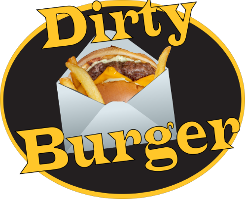

# E-Commerce-Site - Dirty Burger

Dirty Burger, also known as E-Commerce-Site, is a mock full-stack web application designed to emulate the experience of an e-commerce platform. While the site doesn't process real orders, it serves as a showcase for various features typically found in e-commerce applications. The project is hosted on Railway and can be accessed at www.dirtyburgerproject.com.

Technologies Used

Frontend: React Vite
Backend: Node.js, Express
Database: Prisma PostgreSQL
Email Service: Mailgun

Features

User Management: Allows users to sign up and sign in.
Shopping Cart: Enables adding items to a cart.
Checkout Process: A fully functional checkout workflow.
Order Placement and History: Users can place orders and view their order history.
Shipping and Card Information Management: Users can add, set as default, or remove shipping and card information.
User Authentication: Utilizes JWT for secure authentication on requests dealing with user information.

After signing up or logging in, users can add items to their cart and proceed to the checkout page. Although orders are not processed, the application provides a complete walkthrough of the checkout process, including order placement and history viewing in the user profile.
